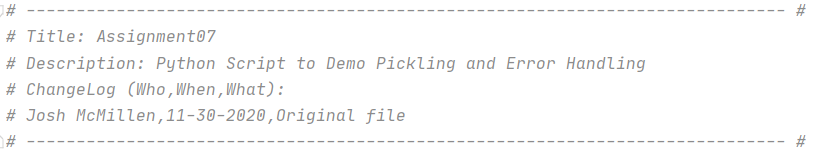
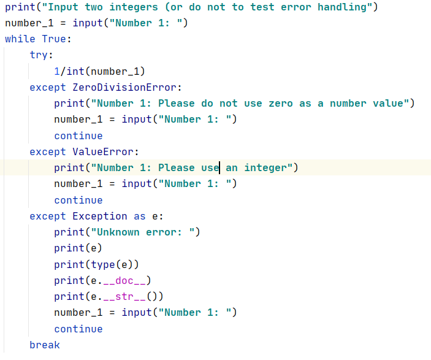
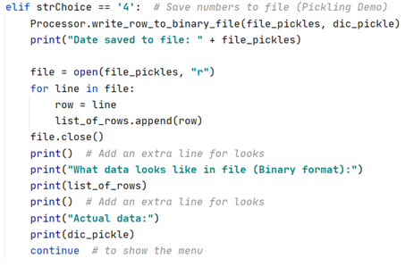
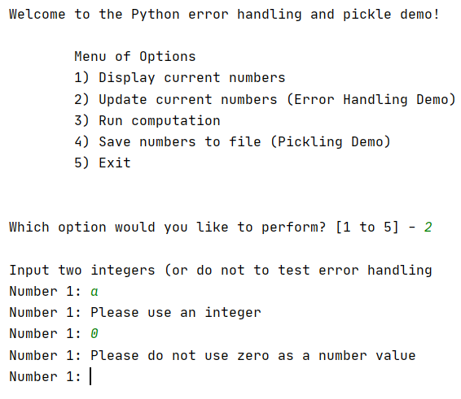
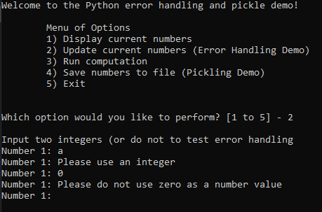
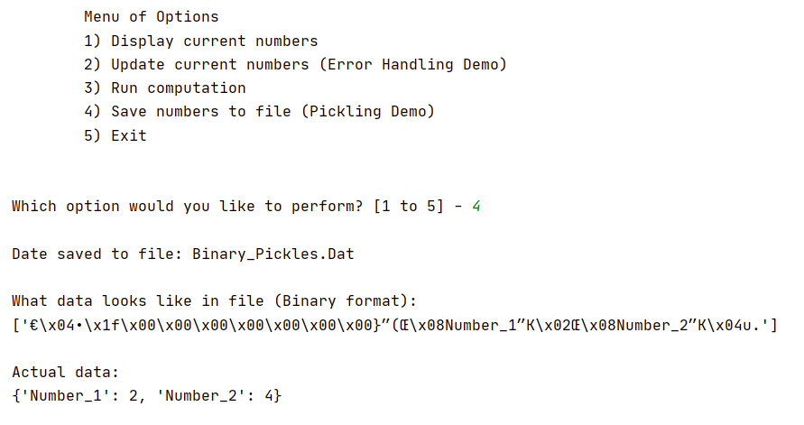
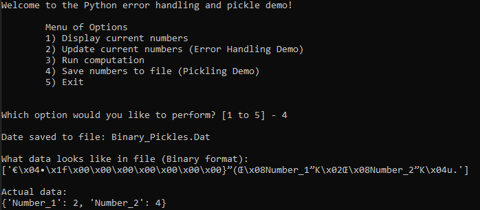
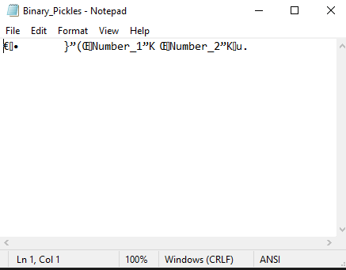

#### Josh McMillen  
12-01-2020  
IT FDN 110 A  
Assignment 07  

# Foundations Of Programming: Python  
Performing Assignment 07  

## Introduction  
This document lays out how to perform assignment 7 in the Foundations of Program: Python course at the University of Washington. In order to complete this assignment I used PyCharm to create a script to take two numbers to demo pickling and error handling.

## Creating the Python script and research  
Since PyCharm was already setup on my machine I simply created a new project in a Assignment07 folder on my C drive. This assignment was different where there the main task was fairly open and more of a “demo”. The main task was to: “Now that you have reviewed the websites and videos, create a new script that demonstrates how Pickling and Structured error handling work.”. To accomplish this I decided to make a menu based program that would take two numbers from the user and demo error handling to make sure they were non-zero integers. These can then be saved to a binary file where the user sees both the binary (hard to read) and non-binary version of the data. To do research beyond the reading/videos I took a look at https://docs.python.org/3/library/pickle.html#data-stream-format and https://docs.python.org/3/tutorial/errors.html heavily. These were direct from the Python documentation and were clear to read with examples that were fairly simple, while having every possible option on the pages as well (further down).

## Script header and overall flow
I added a basic script header which included my name/date/desc (figure 1). Next the “import pickle” was added to enable the pickling options which would otherwise not work. Next a few data items were declared, mainly to set starting data and a hard coded file name. The processing and display sections were mainly used to enable the error handling and pickling functions a place to reside. The main body of the script was a simple while loop that would go through the various user options.

## Error Handling Example
The error handling example I chose to do is in figure 2, 4 and 5. The main idea was to gather two integers from the user to later do some computation on. The error handling uses a while loop to try dividing the numbers by zero, but making the number an integer in the process as well. This would force the value to be non-zero, non-alpha and non-decimal. The method is to use the “try:” function followed by the various possible errors and having unique user messages. There is a catch all error incase I did not hard code in all the possible errors as well. If an error is encountered a message is displayed and the user is re-prompted. The end result is that the user will not see “ugly” or confusing Python errors, but more pleasant custom messages.

## Pickling Example
The pickling example I used in figure 3. 6 and 7. The main idea was to save the two integers into a binary file using the “dump” function, which saves a single row (fine in this context). Alternatively would be to use “dumps” to save the entire variable. When saving you also would use “wb” for writing to a binary file instead of just “w” like for a text file. Next I also opened the file and saved the data in the file as a string to present to the user. This is to show how the binary data actually looks like in figure 8. The data is barely readable and not secure. The main purpose of pickling is to flatten data to save (less space) store classes/etc. for later use and/or send to other locations (databases, etc.). The method is not secure and should not be used as an open ended data sending method as it could be used to inject code.

  
Figure 1

  
Figure 2

  
Figure 3

  
Figure 4

  
Figure 5

  
Figure 6

  
Figure 7

  
Figure 8

## Summary  
To fulfil the requirements of assignment 7 I created a simple user menu program which can be used to demonstrate both error handling and pickling. This is accomplished by walking the user through the error handling and doing a side by side comparison for the pickling process (compared to text files).
